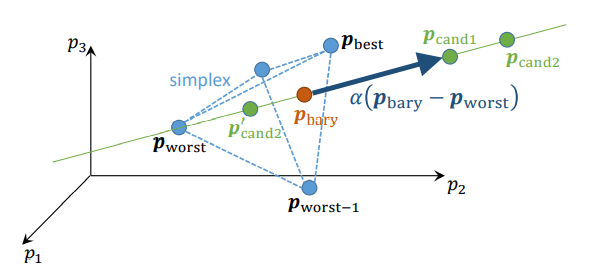

# Overview of Optimization algorithms

## Particle Swarm Optimization
1. Description

   [Particle Swarm Optimization](https://en.wikipedia.org/wiki/Particle_swarm_optimization#:~:text=In%20computational%20science%2C%20particle%20swarm,a%20given%20measure%20of%20quality.) [PSO] method is a population-based optimizer. Instead of improving a single point in the fitness lansdscape, they work with an ensemble of M points (called the population or generation). The goal of one iteration will be to improve the actual generation as a whole such that after each step at least one member of the new generation shows a better fitness. Patricles should interact and profit from each other, find the optimum together and produce the next generation together.
   
   PSO works with many *particles* moving around in the fintess landscapes with both individual and global goals. Each particle has an actual position ***p_m***, velocities ***v_m*** and eventual accelerations ***a_m*** with *m*=1,...*M*. Since any position in the fitness landscape is associated with a possible solution of the optimization problem, each particle in this context is also a potential solution. However the velocity of the particle is not an attribute of the solution itself but rather an attribute of the underlying process consisting of *M* particles walking through the fitness landscape. We additionally maintain the best position of each particle ***p_m,best*** so far and the global optimum postion ***p_global*** as the best of all ***p_m,best***.
   
   
2. PseudoCode

   Denote the following definitions:
   * ***p_m(i)*** a particle's position in iteration i
   * ***v_m(i)*** a particle's velocity in iteration i
   * ***F_m(i)*** a particle's fitness evaluation in iteration i
   * ***p_m,best*** a particle's best fitness evaluation so far
   * ***p_global,best*** entire swarm's best fitness so far
   * ***p_m,best neigh(i)*** the best fitness of a particle's neighborhood (each particle has a defined neighborhood which can be a subset or all particles)
   * ***a_ind***, ***a_grp***, ***w*** swarm topology and randomness
   * ***R_ind(i)***, ***R_grp(i)*** random number or matrix
   
   Each particle feels forces towards ***p_m,best***, ***p_(m,best neigh)*** and possible further forces that coordinate forces or forbid particles to leave the search domain, etc. In a first attempt all the above forces could for example be initialized through physical principles that keep take the distance between particles into consideration.

   * Distribute *M* particles on the fitness landscape *D_s*
   * for each iteration i update each ***v_m(i+1)*** and ***p_m(i+1)***:
      * v_m(i+1) = w * v_m(i) + a_ind * R_ind(i) * (p_m,best - p_m(i)) + a_grp * R_grp(i) * (p_(m,best neigh) - p_m(i))
         * w * v_m(i) : inertia or momentum
         * a_ind * R_ind(i) * (p_m,best - p_m(i)) : towards the individual best
         * a_grp * R_grp(i) * (p_(m,best neigh) - p_m(i)) : towards the group best
      * p_m(i+1) = p_m(i) + v_m(i+1)
      
      forces increase with larger distances
   * update ***p_m,best*** and/or ***p_global***
      
   
3. Advantages/Disadvantages

   * Advantages : 
      * can solve parameter optimization problems with correct implementation and well set tuning screws
      * more resilience to local optimum problem compared to optimization methods as simulated annealing
      * no need for the use of gradients, thus robust for discontinuous or noisy functions
      
   * Disadvantages :
      * high number of options that need to be decided (weighthing of different forces, distance behavior, limit velocity or not, number of neighbors, what to do with particles that leave the fitness landscape, etc.)
      * large number of fitness evaluations
      * its success relies on some optimistic expectations (swarm concentrates towards optimum, avoid bad regions automatically, randomnes in each particle sufficient to find global optimum, etc. )
      


4. Notes on Python implementation

We are going to use the Particle Swarm optimizer provided by the [PySwarms library](https://pyswarms.readthedocs.io/en/latest/).

###

## Nelder Mead
1. **Description**
   

   [Nelder-Mead](https://en.wikipedia.org/wiki/Nelder%E2%80%93Mead_method) [NM] method (also called Downhill Simplex) uses a *simplex*, i.e. the 'most simple volume' in the parameter space with **N+1** corner points **p_j**. In every iteration of the algorithm, the point with the worst (that is, maximum) fitness evaluation gets replaced by a better one. If the simplex gets sufficiently small, the fitness values provide a reasonable approximation of the gradient.

2. **Algorithm/Pseudocode**
   
   Denote the following definitions:
   * the best point: **F_best = F(p_best)**
   * the worst points: **F_worst = F(p_worst)**, and **F_(worst-1) = F(p_(worst-1))**
   * the barycenter: **p_bary**, centroid of all ***but*** the worst point
   * the search line **L** along two points, which can be defined as **L = p + a(p - q)** for some parameter **a** and points **p** and **q**
   * the parameters:
     * **alpha** > 0 (reflection)
     * **beta**  with beta > alpha (expansion)
     * **gamma** between 0 and 1 (contraction)
     * **sigma** between 0 and 1 (shrinking)


   We start of with an initial simplex, i.e. the **N+1** corner points, and sort them according to the fitness value in order to calculate the candidates above. Then, for every iteration, we do the following:
   ```
   p_cand1 = p_bary + alpha * (p_bary - p_worst)

   if F(p_cand1) < F_best:
      - try p_cand2 = p_bary + beta * (p_bary - p_worst)    # with beta > alpha
      - replace p_worst by better of p_cand1, p_cand2

   else if F(p_cand1) >= F_best && F(p_cand1) < F_(worst-1):
      - replace p_worst by p_cand1

   else if F(p_cand1) < F_worst:
      # p_cand1 is better then the worst, but not as good as worst-1
      # --> new candidate outside of simplex, but not as far as p_cand1

      - try p_cand2' = p_cand1 + gamma * (p_bary - p_cand1) # gamma < 1
      - replace p_worst by p_cand2' if better
        else SHRINK

   else if F(p_cand1) >= F_worst:
      # new candidate inside the simplex
      - try p_cand2' = p_worst + gamma * (p_bary - p_worst)
      - replace p_worst by p_cand2' if better
        else SHRINK

   SHRINK: # nothing was succesful, so just shrink the simplex
      - replace p_j by p_j' = p_j + sigma * (p_best - p_j)
        for every j
   ```

   A common choice of parameters is alpha = 1, beta = 2, gamma = 0.5 = sigma.

3. **Advantages/Disadvantages**
   
   | Advantages                                           | Disadvantages                                                       |
   | -----------------------------                        | --------------------------------                                    |
   | - does not require gradient                          | - lack of convergence theory, properties                            |
   | - relatively simple to understand, implement and use | - slow convergence (esp. compared to other gradient based methods)  |
   | - often only needs two evaluations per iteration     | - can take enormous amount of iterations with little improvement    |
   | - proven to work well in practice                    | - can get stuck in local minima                                     |
   | - can deal with any number of variables              | - very much depends on initialization of simplex (too small can lead to local search) |
   | - easily adaptable with e.g. random restart

4. **Notes on Python implementation**
   
   We are using the method implementing Nelder-Mead provided by the SciPy-Optimize library: https://docs.scipy.org/doc/scipy/reference/optimize.minimize-neldermead.html

   It is based on basic NumPy and implements the exact algorithm described above (the source code can be found under the link). Interestingly, it also uses the standard choice of parameters, but is has an additional *adaptive* option:

   ```
   if adaptive:
      rho = 1
      chi = 1 + 2/N
      psi = 0.75 - 1/(2*N)
      sigma = 1 - 1/N
   else:
      rho = 1
      chi = 2
      psi = 0.5
      sigma = 0.5
   ```
   Here, alpha = rho, chi = beta and psi = gamma.

## Simulated Annealing
   
   1. Description:
       
       ##### **The basic iteration:**
       At each step, the simulated annealing heuristic considers some neighboring state $s^{*}$ of the current        state $s$, and probabilistically decides between moving the system to state $s^{*}$ or staying in-state        $s$. These probabilities ultimately lead the system to move to states of lower energy.
       
       ##### **The neighbours of a state:**
       Optimization of a solution involves evaluating the neighbours of a state of the problem, which are new        states produced through conservatively altering a given state. The well-defined way in which the states        are altered to produce neighbouring states is called a "move", and different moves give different sets        of neighbouring states. These moves usually result in minimal alterations of the last state, in an            attempt to progressively improve the solution through iteratively improving its parts.
       
       ##### **Acceptance probabilities:**
       The probability of making the transition from the current state $s$ to a candidate new state $s'$ is          specified by an acceptance probability function $P(e,e',T)$, that depends on the energies $e=E(s)$ and        $e'=E(s')$ of the two states, and on a global time-varying parameter $T$ called the temperature. States        with a smaller energy are better than those with a greater energy. The probability function $P$ must be        positive even when $e'$ is greater than $e$. This feature prevents the method from becoming stuck at a        local minimum that is worse than the global one. 
       
       When $T$ tends to zero, the probability $P(e,e',T)$ must tend to zero if $e'>e$ and to a positive value        otherwise. For sufficiently small values of $T$, the system will then increasingly favor moves that go        "downhill" (i.e., to lower energy values), and avoid those that go "uphill." With $T=0$ the procedure          reduces to the greedy algorithm, which makes only the downhill transitions.

       In the original description of simulated annealing, the probability $P(e,e',T)$ was equal to 1 when            $e'<e$ i.e., the procedure always moved downhill when it found a way to do so, irrespective of the            temperature. Many descriptions and implementations of simulated annealing still take this condition as        part of the method's definition. However, this condition is not essential for the method to work.

       The $P$ function is usually chosen so that the probability of accepting a move decreases when the              difference $e'-e$ increases that is, small uphill moves are more likely than large ones. However, this        requirement is not strictly necessary, provided that the above requirements are met.

       Given these properties, the temperature $T$ plays a crucial role in controlling the evolution of the          state $s$ of the system with regard to its sensitivity to the variations of system energies. To be            precise, for a large $T$, the evolution of $s$ is sensitive to coarser energy variations, while it is          sensitive to finer energy variations when $T$ is small.
       
       ##### **The annealing schedule:**
       The name and inspiration of the algorithm demand an interesting feature related to the temperature            variation to be embedded in the operational characteristics of the algorithm. This necessitates a              gradual reduction of the temperature as the simulation proceeds. The algorithm starts initially with          $T$ set to a high value (or infinity), and then it is decreased at each step following some annealing          schedule—which may be specified by the user, but must end with $T=0$ towards the end of the allotted          time budget. In this way, the system is expected to wander initially towards a broad region of the            search space containing good solutions, ignoring small features of the energy function; then drift            towards low-energy regions that become narrower and narrower; and finally move downhill according to          the steepest descent heuristic.
       
       For any given finite problem, the probability that the simulated annealing algorithm terminates with a        global optimal solution approaches 1 as the annealing schedule is extended. This theoretical result,          however, is not particularly helpful, since the time required to ensure a significant probability of          success will usually exceed the time required for a complete search of the solution space.
       
       <br/>
       
   2. PseudoCode:
   
      **Denote the following parameters:**
       * $E(\;)$ = the energy (goal) function
       * $neighbour(\;)$ = the candidate generator procedure
       * $P(\;)$ = the acceptance probability function
       * $temperature(\;)$ = the anealing schedule 
       
       <br/>
     
      **Algorithm:** 
       * Let $s = s_0$
       * For $k = 0$ trough $k_{max}(exclusive)$:
            * $T \leftarrow temperature((k+1)/k_{max})$
            * Pick a random neighbour, $s_{new} \leftarrow neighbour(s)$
            * If $P(E(s), E(s_{new}),T) \geq random(0,1)$:
               * $s \leftarrow s_{new}$
       * Output: the final state $s$ 
       
       <br/>
       
   3. Advantages/Disadvantages:
   
       * Advantages:
           * Simulated annealing is used to find a close-to-optimal solution among an extremely large (but                  finite) set of potential solutions. It is particularly useful for combinatorial optimization                  problems defined by complex objective functions that rely on external data.  
           * TBD
       
       <br/>
       
       * Disadvantages:
           * TBD
           
           <br/>
           
   4. Notes on Python implementation:
   
       Possible library: https://github.com/perrygeo/simanneal
       
       TBD
